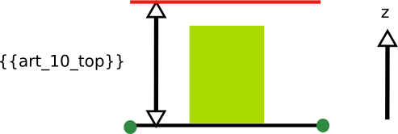

#  Regle-art-10 - Hauteur maximale des constructions

## Modèle de phrase

> La hauteur de construction ne doit pas dépasser une hauteur **{{art_10_top}}** dont la modalité est fixée par le paramètre **{{art_101}}**  

## Paramètres

### art_10_top

Valeur maximale de hauteur en m ou en nombre d'étages (88= non renseignable, 99=non réglementé). Dans le cas où la hauteur maximale n'est pas renseignée, la valeur utilisée est celle du fichier parametreScenario.xml (maxheight).

### art_101

Cette valeur fixe la modalité de calcul de la hauteur. Plusieurs valeurs sont possibles mais se résument à trois cas :
- Pour la valeur **1** : la hauteur maximale est considérée comme un nombre d'étage et la hauteur calculée en m à partir de la valeur du fichier parametreScenario.xml (heightStair) [ **{{art_10_top}}** * heightStair ] ;
- Pour les valeurs **2 - 5** : la hauteur maximale est calculée en m à partir de la valeur  **{{art_10_top}}** ;
- Pour les valeurs **6 - 8** : les hauteurs maximales sont évaluées à partir des hauteurs des bâtiments voisins. Les hauteurs maximales et minimales des boîtes sont fixés comme étant à 90% et 110% dans un rayon de 50 m. S'il n'y a pas de bâtiments autour la hauteur maximale est évaluée en fonction de l'attribut **{{art_10_top}}** considéré comme en m.

## Explications

**{{art_10_top}}** désigne la hauteur maximale des bâtiments en fonction de la modalité fixé par le paramètre **{{art_101}}** .

## Implémentation
L'implémentation est dans la classe CommonRulesOperator et la détermination des hauteurs des bâtiments (pourl es cas 6 à 8) s'effectue dans les classes PredicateArtiScales et MultiplePredicateArtiScales.
