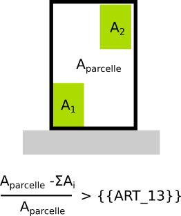

#  Regle-art-13 - Coefficient de biotope

## Modèle de phrase

> **{{ART_13}}**% au moins de la surface de l’opération doit être plantée

## Paramètres

### ART_13

Désigne le ratio minimum d'espace végétalisé au sein de la parcelle. Valeur entre 0 et 1.

**0.5>700** Si l'argument suit ce format, cela signifie que seul les parcelles d'une supérficie supérieure à 700m² doivent respecter ce coefficient de biotope 

Remarque : Si valeur exprimée en %, convertir en ratio. Ex : 5%= 5/100 = 0,05 ; 85%= 85/100 = 0.85

## Explications

## Implémentation

La méthode est implémentée en même temps que l'article 9 dans la méthode getCesMax(). Ainsi, on prend le règlement le plus contraignant entre l'article 9 et l'article 13.
