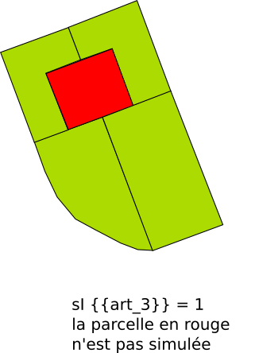

# Rule-art-003 - Servitude de passage

## Modèle de phrase

>La parcelle qui n’a pas accès à la voirie doit mettre à disposition une servitude de passage (Cette règle s'applique en fonction de la valeur du paramètre{{ART_3}}).

## Paramètres

### {{ART_3}}

Valeurs :
**0** : L’article ne s’applique pas
**1** : La parcelle qui n’a pas accès à la voirie doit mettre à disposition une servitude de passage
**99** : Non renseigné

La parcelle en rouge ici n'est pas simulée.

## Implémentation

La vérification s'effectue en amont de la simulation lors de l'instanciation de la classe Predicte (MultiplePredicateArtiScales ou PredicateArtiScales) qui vérifie le respect des règles. Si la parcelle concernée par ces règles n'a pas de limite séparative annotée comme donnant sur la voirie (valeur ParcelBoundaryType.ROAD de SimPLU3D-rules) alors la simulation n'est pas effectuée.
