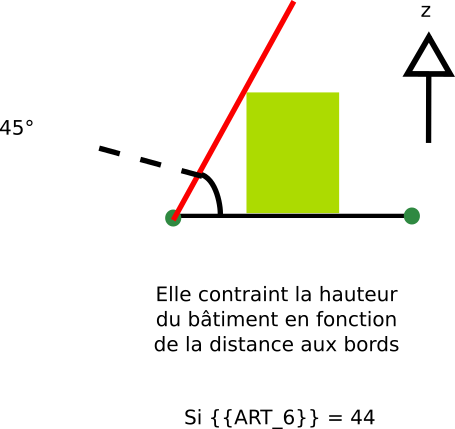

# Rule- art_6_type -  Type de contraintes de recul par rapport à la voirie

Valeur optionnelle du recul des constructions par rapport à la voirie en mètres

## Modèle de phrase

## Paramètres

### ART_6

Méthode de calcul du recul par rapport à la voirie

Autre contrainte de recul :
-  **1** : distance en retrait de routes, renseignées dans le champ **Art6_defaut**
- **10** : peut soit être implanté en limite séparative, soit doit respecter un retrait renseigné dans le champ **Art6_defaut**
- **20** : doit respecter l'alignements de l’une des construction voisine. Si aucune, voir le champ **Art_6_defaut** et/ou le champ **art_6_optionel**
- **30** : doit respecter les alignements des deux constructions voisines. Si aucune, voir **Art6_defaut** ou **Art6_optionnel**
- **44** : la distance comptée horizontalement de tout point du bâtiment au point le plus proche de l'alignement opposé doit être au moins égale à la différence d'altitude entre ces deux points.

## Explications

## Implémentation

