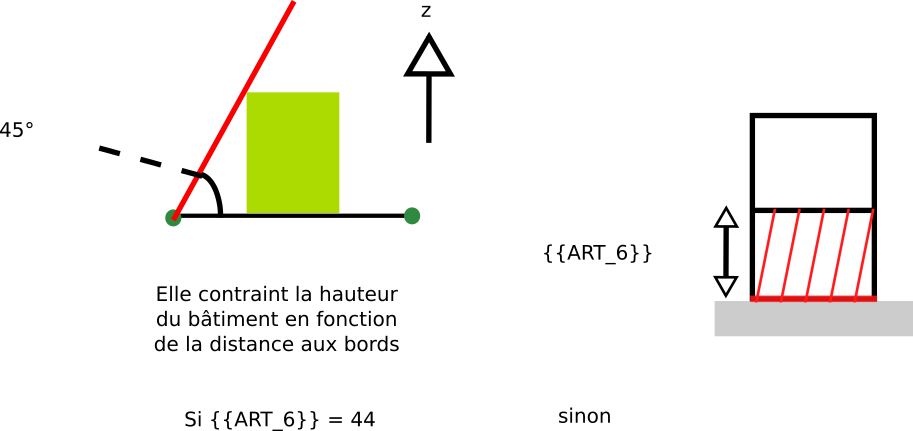

# Rule-art-006 -  Distance minimale à la voirie

## Modèle de phrase

> Les bâtiments ne doivent pas être construits à une distance inférieure à **{{ART_6}}** de la voirie.

## Paramètres

### ART_6

Différentes valeurs sont possibles :
- **-1.0** : Alignement du bâtiment le long de la voirie (Non implémenté puisque ne semble pas nécessaire, mais à confirmer)
- **44.0** : Application d'un prospect par rapport à la voirie d'après le RNU
- **Autres valeurs** : valeur en m du recul du bâtiment par rapport à la voirie

## Explications

## Implémentation

La vérification du ratio s'effectue dans la classe CommonPredicateArtiScales.
