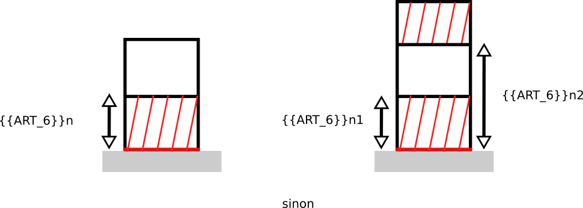

# Rule-art-006 -  Distance minimale à la voirie

## Modèle de phrase

> Les bâtiments ne doivent pas être construits à une distance inférieure à **{{ART_6}}** de la voirie.

## Paramètres

### ART_6

Différentes valeurs sont possibles :
- **1.0** : Alignement du bâtiment le long de la voirie (Non implémenté, redéfinir la valeur)
- **44.0** : Application d'un prospect par rapport à la voirie d'après le RNU
- **55.0** : Contrainte de recul appliquée par rapport à la voirie en fonction du paramètre (art_6_optD). (Mal défini et non implémenté)
- Autre valeur : valeur en m du recul du bâtiment par rapport à la voirie

## Explications

## Implémentation

La vérification du ratio s'effectue dans la classe CommonPredicateArtiScales.
