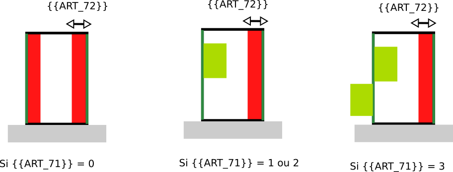

# Rule-art-0071 - Rule-art-0072- Distance et alignement par rapport aux limites séparatives

## Modèle de phrase

> Une distance par rapport aux limites séparatives latérales de la parcelle de {{ART_72}} m doit être respectée.
> Un alignement est imposé par rapport aux côtés des limites séparatives  {{ART_71}}

## Paramètres

### ART_71

Implantation en limite séparatives :

* 0 : Non, retrait imposé (cf.ART_72)
* 1 : Oui des deux côtés
* 2 : Oui, mais sur un côté seulement
* 3 : Oui seulement si un bâtiment est déjà en limite de propriété

### ART_72

Distance de recul en m par rapport aux limites séparatives latérales.
- 88 : non renseignable
- 99 : non réglementé

## Explications

Suivant les cas imposés par {{B1_ART_72}} :
* si **{{ART_71}}** = 0, on ne peut construire à moins de {{ART_72} m des limites latérales ;
* si **{{ART_71}}** = 1, le bâtiment doit être construit des deux côtés de la parcelle ;
* si **{{ART_71}}** = 2, le bâtiment doit être collé d'un côté de la parcelle et respecter un recul de **{{ART_72}}** m par rapport à l'autre côté.
* si **{{ART_71}}** = 3, le bâtiment est collé aux côté qui intersectent des bâtiments issus des parcelles voisines.

## Implémentation

L'implémentation des reculs en m (**{{ART_72}}**) est effectuée dans la classe CommonPredicateArtiScales. Concernant le fait de coller le bâtiment contre l'un des côté (**{{ART_71}}**), cela a été implémenté la classe SimPLUSimulator. Si l'article **{{ART_71}}** impose au bâtiment d'être aligné sur une des limites latérales, le simulateur effectue deux simulation en alignement à gauche et à droite et conserve la configuration offrant la meilleure optimisation. En fonction de la simulation, le recul **{{ART_72}}** sera appliqué seulement contre le côté qui n'est pas concerné par l'alignement.
