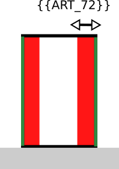

# Regle-art-72 - Distance et alignement par rapport aux limites séparatives

## Modèle de phrase

> Une distance par rapport aux limites séparatives latérales de la parcelle de **{{B1_ART_72}}** m doit être respectée.

## Paramètres

### art_72

Distance de recul par rapport aux limites séparatives latérales :
- **88** : non renseignable
- **99** : non applicable
- Autre valeur : distance en m.

## Explications

 Distance minimale des constructions par rapport aux limites séparatives latérales imposée en mètre :

## Implémentation

La vérification de la distance s'effectue dans la classe CommonPredicateArtiScales.
