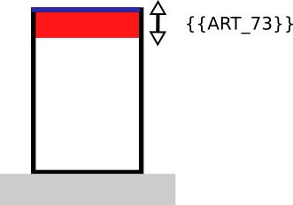

# Regle-art-73 - Distance par rapport au fond de parcelle

## Modèle de phrase

> Une distance de **{{ART_73}}** m doit être respectée par rapport au fond de la parcelle.

## Paramètres

### ART_73

Distance de recul en mètre par rapport au fond de la parcelle.

Valeurs particulières :
* 88 : non renseignable
* 99 : non réglementé

## Explications

Un recul de  {{ART_73}} m s'applique par rapport au fond de la parcelle.

## Implémentation

La vérification de la distance s'effectue dans la classe PredicateIAUIDF sauf si les valeurs sont 88 et 99.
