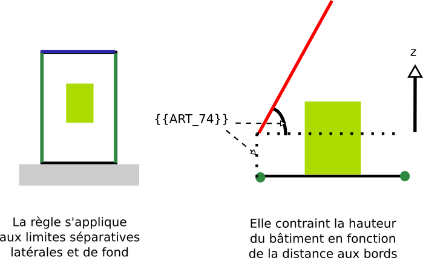

# Regle-art-74 - Distance minimum des constructions par rapport aux limites séparatives, exprimée par rapport à la hauteur du bâtiment

## Modèle de phrase

> La hauteur doit être inférieure à **{{ART_74}}** fois la distance aux limites séparatives latérales et de fond de la parcelle.

## Paramètres

###  ART_74

Coefficient multiplicateur désignant la hauteur maximale du bâtiment par rapport aux limites séparatives latérales et de fond de parcelle. Différents cas sont envisagés en fonction de la valeur de **{{ART_74}}**
   **0** : Pas de prospect    **1** : Retrait égal à la hauteur   **2** : Retrait égal à la hauteur divisé par deux   **3** : Retrait égal à la hauteur divisé par trois   **4** : Retrait égal à la hauteur divisé par quatre   **5** : Retrait égal à la hauteur divisé par cinq   **6** : Retrait égal à la hauteur divisé par deux moins  trois mètres  **7** : Retrait égal à la hauteur moins trois mètres divisé  par deux   **8** : retrait égal à la hauteur divisé par deux moins un mètre   **9** : retrait égal aux deux tiers de la hauteur   **10** : retrait égal aux trois quarts de la hauteur  

## Explications

**{{ART_74}}** représente la pente du plan sous lequel le bâtiment doit se trouver.

## Implémentation

La vérification s'effectue dans la classe CommonPredicateArtiScales et les différents cas pris en compte sont implémentés en dur dans la classe CommonRulesOperator et la méthode.
