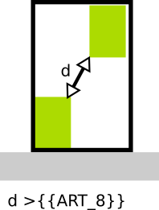

#  Regle-art-08 - Distance minimale entre bâtiments

## Modèle de phrase

> La distance entre les bâtiments au sein de la parcelle doit être supérieure à **{{ART_8}}** m.

## Paramètres

### ART_8

Valeur en mètre de la distance minimale à respecter entre deux bâtiments. Si la valeur n'est pas définie (**{{ART_8}}** = 99) alors un recul de 3 m sera appliqué.

## Explications

**{{ART_8}}** indique la distance minimale qui doit être respectée entre deux bâtiments.
Cela concerne les bâtiments existants et les bâtiments simulés (un bâtiment = ensemble connexe de boîtes).
Si l'intersection entre boîtes est autorisée (cf paramètre **{{intersection}}**), une autre distance s'ajoute et est fixée comme étant la moitié de la hauteur du bâtiment le plus haut.

## Implémentation

La vérification de la distance s'effectue dans la classe CommonPredicateArtiScales en deux fois (1/ entre bâtiments existants et simulés et 2/ entre bâtiments simulés)
