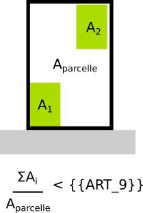

#  Regle-art-09 - Coefficient d'emprise au sol maximum

## Modèle de phrase

> Le coefficient d'emprise au sol (rapport entre surface bâtie et surface de la parcelle) est limité à {{ART_9}}.

## Paramètres

### ART_9

Valeur maximale du coefficient d'emprise au sol (entre 0 et 1)

Remarque :  Si valeur exprimée en %, convertir en ratio. Ex : 5%= 5/100 = 0,05 ; 85%= 85/100 = 0.85

## Explications

**{{ART_9}}** indique le ratio maximal entre la surface bâtie et la surface de la parcelle.

## Implémentation

La vérification du ratio s'effectue dans la classe CommonPredicateArtiScales. Si la parcelle intersecte plusieurs zones, le coefficient est évolué au pro rata des valeurs des zones intersectées.
