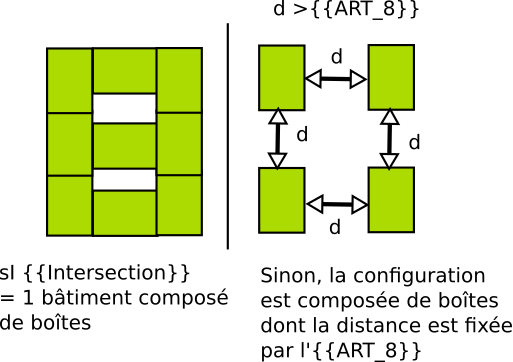

# Rule-form-003 - Intersection entre boîtes

## Définition

>  Le simulateur autorise la construction de bâtiments composés de plusieurs boîtes qui s'intersectent.

## Paramètres

**{{intersection}}** :  indique si les intersections entre boîtes sont autorisées. Si ce n'est pas le cas, c'est la valeur de l'**{{art_8}}** qui fixe cela.

## Explications

